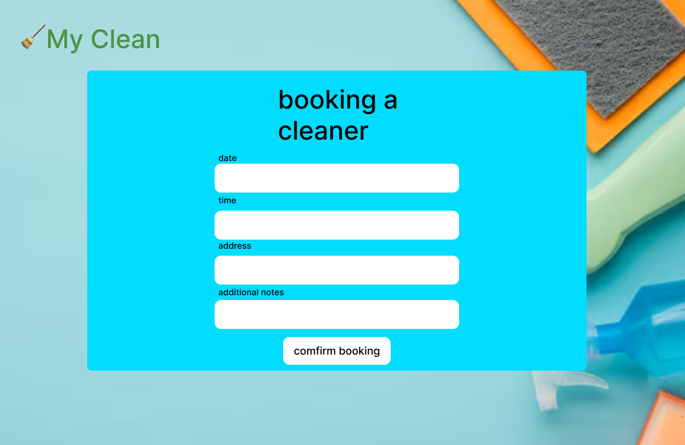

# User Story Title: Book a Cleaner

This story allows a customer to schedule a cleaning appointment with a service provider for a specific date and time.

---

## Priority: 10 (High)
This is one of the most essential user stories. It represents the core feature of the MyClean app allowing users to book services.

---

## Estimation: 3 days
- Yunseo: 3 days

---

## Assumptions:
- The customer is already logged in
- The cleaner selection can be manual or auto-assigned
- The booking must store time, date, and optional notes

---

## Description:
**Description1**: As a customer, I want to book a cleaner for a specific date and time so that I can schedule a cleaning when it suits me.  
**Description2**: Customers should be able to select a date/time and optionally choose a cleaner. The system must save the booking to the database and confirm the slot.

---

## Tasks:

1. Design booking form UI – 0.5 day  
2. Create database table for bookings – 0.5 day  
3. Add date/time picker and input fields – 0.5 day  
4. Implement backend API to save booking – 0.75 day  
5. Add validation – 0.5 day  
6. Display confirmation message or screen – 0.25 day  

---

## UI Design (Mockup Screenshot):

---

## Completed: task 1, task 2
